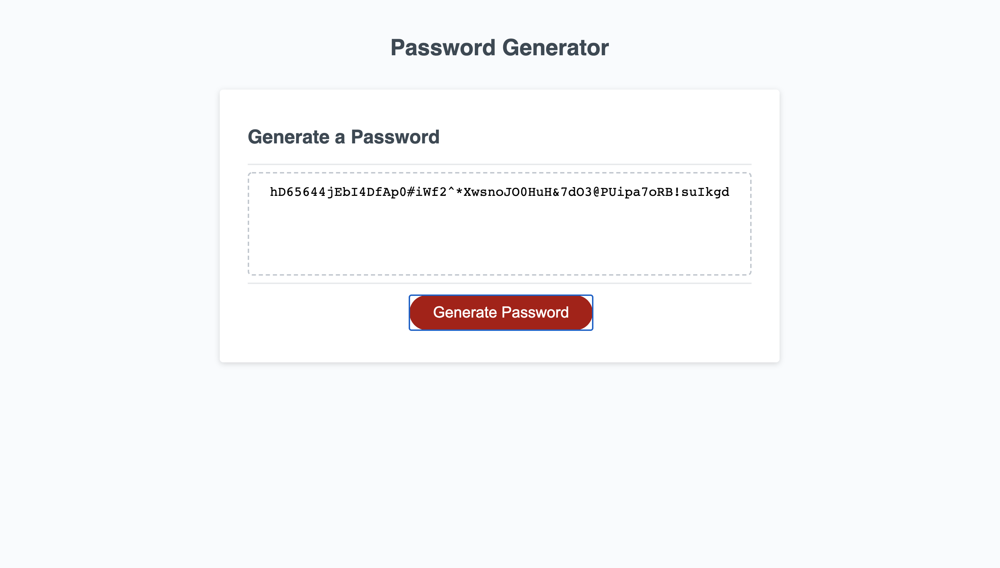

# passwordGenerator

## Description

Using Javascript, I created an application that takes prompts from the user on length and which character types to use for a password, and then randomly generates a password using that information.

## Usage

Click the generate password button, and follow the instructions given by the page to generate your unique password.